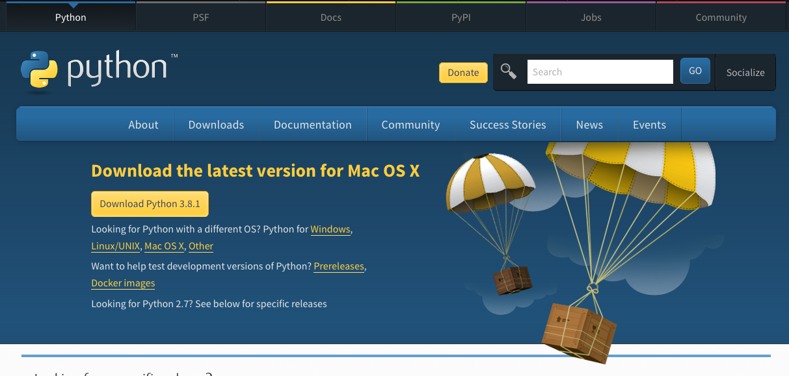
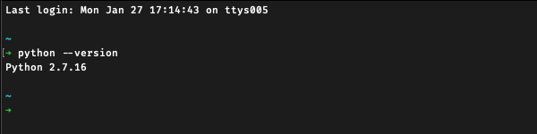
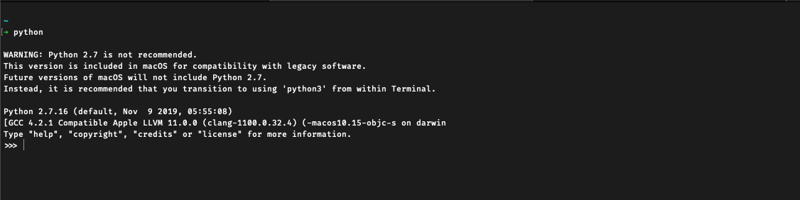
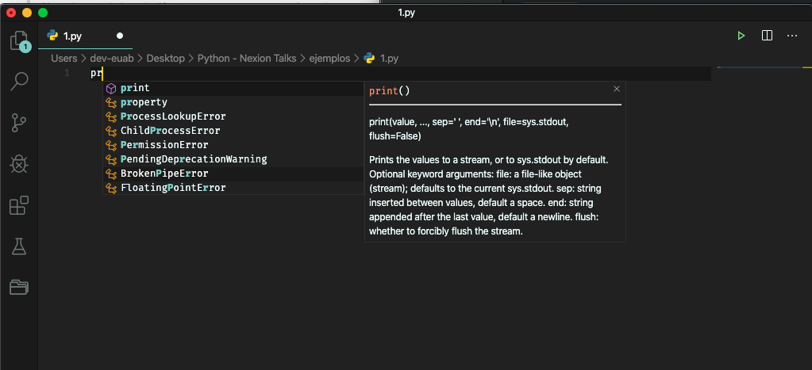
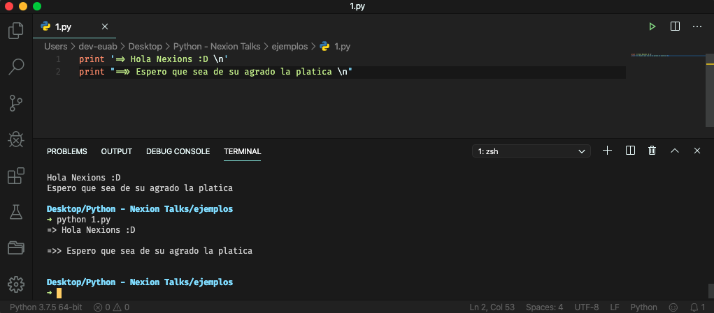
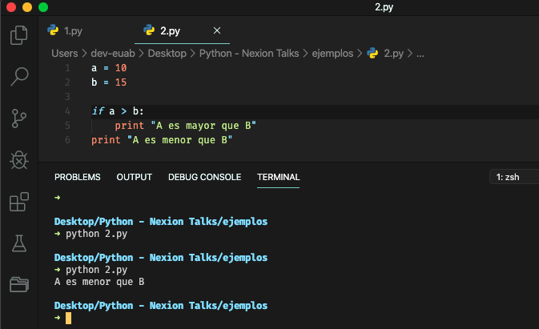
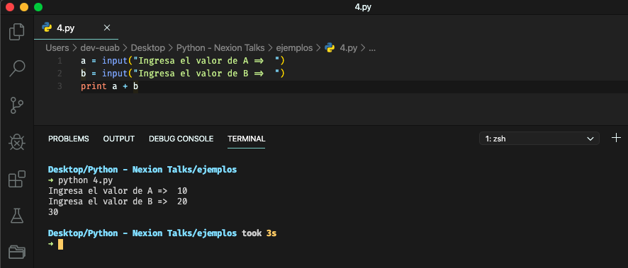
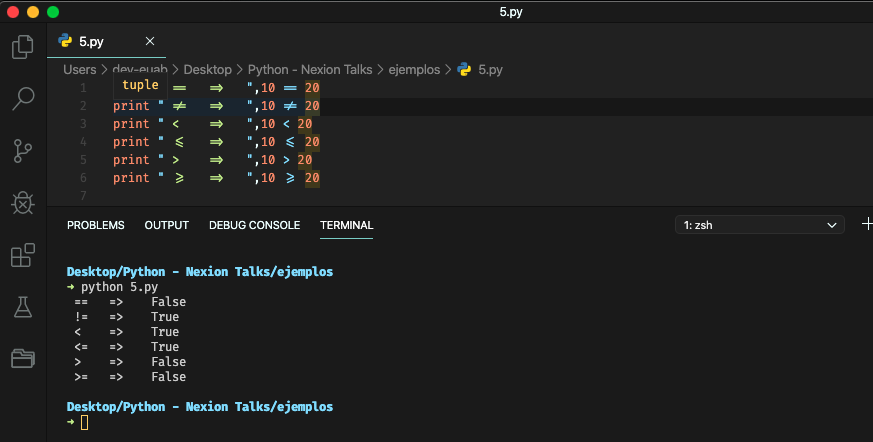
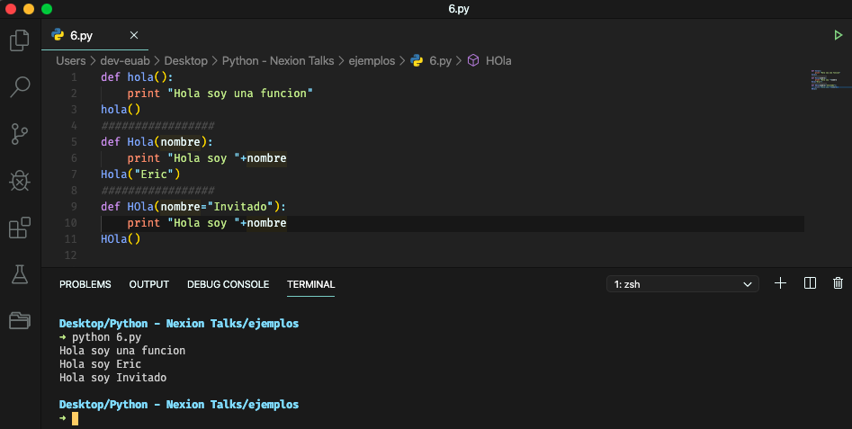
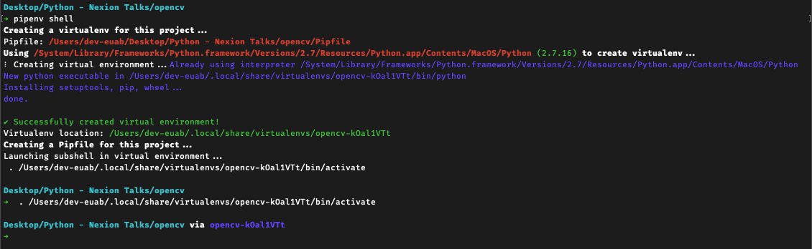

#Python 🐍
By Eric Uriel Avila Barrios 🤓

##¿Qué es Python?

* 👉🏼 Sintaxis sencilla y "amigable 🤨" 👈🏼
* Gran cantidad de Bibliotecas 😎
* Gran Comunidad 🤩

#1.- Instalación ⚙️

##Windows



> Nota durante la instalación aceptar que agregue Python al **PATH**

[Python Instalador](https://www.python.org/downloads/windows/)

####Comando  *CMD* 👇🏼

```
	python --version
```	


##Mac / Linux
Normalmente traen por defecto Python instalado, para comprobar abriremos una terminal y ejecutaremos el siguiente Comando

####Comando  *Terminal* 👇🏼

```
	python --version
```	




> Se observa que existe de manera 🎈**global**🎈 una versión de Python


**_Comprobar instalación_**



#2.- Ejecución 🤓 ⌨️
Una vez que se comprobó que **Python**  está instalado de manera correcta, podemos proseguir a hacer nuestro primer programa ✎

Todo programa de Python termina con una extensión **.py**

Se puede utilizar el Editor de preferencia, en este caso será **VSCODE** 🙋🏻‍♂️



####Comando  *Terminal* 👇🏼

```
	python [nombre del archivo Python]
```	



🎊🎉 YEAH!!!... 🎊🎉

#3.- Estructura en Python 🐍
**¿QUÉ?**🤨 **¿Estructura?...**😕
Así es, normalmente en la mayoría de lenguajes de programación tu haces una función o un bloque de código y no importa cómo lo escribas, siempre y cuando respetes el "inicio" y el "fin", el abrir y cerrar llaves, corchetes. Y ¿a dónde quiero llegar?... ☹️ pues la manera de declarar una función, una condición, un ciclo un bloque de código tiene la peculiaridad de la **IDENTACIÓN** 🧐

Veamos un ejemplo 😉



Un momento... ¿dónde esta el punto y coma? 😱

> En Python puedes prescindir del **;**


#4.- Interacción con Python

Python como se le aprecia, tiene su ambiente por medio de la **terminal** 🖥 con la cual podemos interactuar para poder ingresar datos



Si quisiéramos ingresar algún tipo de dato especifico seria de la siguiente manera

```python
int( input ("Ingresa un valor tipo Entero") )
float( input ("Ingresa un valor tipo Entero") )
str( input ("Ingresa un valor tipo Text") )
```
> Se **parsea** antes de ejecutar el **Input** para definir su valor 

#5.- Igual que todos...
Al igual que cualquier otro lenguaje de programación Python cuenta con sus 

##Tipos de Datos

```python
* string
* int
* float
* boolean
* list
* tuplas => es una lista que no puede cambiar (inmutable)
* diccionarios => {"key" : "value" , "key" : "value" }
* None == Null (En otros lenguajes de programación)
```

##Operadores Aritméticos
```python
+
-
*
/
```


##Operadores Lógicos
```python
==
!=
<
<=
>
>=
```


>Nota cuando uno declara una variable, está puede tener el mismo nombre que otra siempre y cuando cambie una letra Mayúscula o Minúscula a esto se le conoce como => **Case Sensitive**
>
>Se puede declarar un "bloque" de variables en una sola linea y asignar el valor de cada uno respetando el orden en el cual fue declarado

```python
nombre, edad = "Luis", 28
```

##Ciclos
```python
#FOR
for contador in range(1,10):
	print contador
```

```python
#WHILE
	numero = 0
	while numero <= 10:
		print numero
		numero += 1
```

```python
#DO WHILE
#NO EXISTE EN PYTHON
```

###Constante
En Python no existe como tal los valores constantes, no existe un método para "definirlos" o "asignar" el tipo "constante", se utiliza una regla de escritura la cual al poner todo el nombre en mayúscula

```python
PI = 3.1416
```

##Funciones
También cuenta con su respectiva declaración de una Función



>Si deseáramos pasar los argumentos en otro orden se puede hacer de la siguiente manera, ejemplo:

```python
def argumentos(a,b)
	return a - b

argumentos(b=20,a=10)
```

>En caso de que se desconozca la cantidad de argumentos que vayan a pasar por la función, se hace de la siguiente manera

```python
def muchosArgumentos(*args):
	print(args)

muchosArgumentos(1,2,3,a,b,c,d,e)
```

>Y si se decidiera hacer un diccionario seria de la siguiente manera

```python
def muchosKeyArgumentos(**kwargs):
	print(kwargs)

muchosKeyArgumentos(a=1,b=2,c=3)
```

##Clases

La declaración de una Clase es de la siguiente manera

```python	
class nombreClase()
	#Constructor
	def __init_(self,args):
		self.argumentoA = ""
		self.argumentoB = ""
		print("Se ha instanciado la clase")
		
	def metodoA()
		pass
	
	def metodoB()
		pass
	
	def __metodoPrivado()
		pass
		
	#Destructor de clase
	def __del__(self)

```

Instanciar una clase

```Python
clase = nombreClase()
```

#Casos donde se aplica Python

##Python y RaspBerry

U cualquier otra plataforma de "mini computadoras"


Dado al proceso de montaje de está "mini computadora" es posible accesar a los *pines* para poder interactuar con *módulos* que se conectaran a ellos utilizando librerías desarrolladas en **Python**

[Python + RaspBerry PI](https://projects.raspberrypi.org/en/projects?software[]=python)

##Python Análisis de Imágenes / Video


Una librería llamada *OPENCV* es utilizada en Python para el análisis de videos y de imágenes.


[Video => Curve Lane Detection](https://www.youtube.com/watch?v=-RuWTwDlot8&feature=youtu.be&fbclid=IwAR0r8OSPHKaNMDG6zD62vNWwkiFQ_LN6tbboko76HJak-obEcY9F-9qGDFs)


###Su repositorio en GITHUB

[OpencV](https://github.com/opencv/opencv)

###Grupos en Facebook
[Grupo Opencv A](https://web.facebook.com/groups/17450909269/)

[Grupo Opencv B](https://web.facebook.com/groups/2069477769970396/learning_content/)

##Servicios Web

Algo maravilloso es que puedes tener desde un sitio Web hasta una poderosa API, dos conocidos **DJANGO** y **Flask**


[GITHUB DJANGO](https://github.com/django/django)


[GITHUB FLASK](https://github.com/pallets/flask)


#TIP 😏
Si tienes una emergencia y solo quieres ver como se verían algunos estilos **CSS** , algunos **JAVASCRIPT**, un sitio web solo su **FRONT END** utiliza

####Comando  *CMD* 👇🏼

```
	#2.7
	python -m SimpleHTTPServer 8000
```	

```
	#3.X
	python -m http.server 8000
```	 

#YA QUIERO EMPEZAR!!!... Alto ahí!!! 🤬 🙄
Un consejo antes de bajar librerías e intentar construir tu próximo Tesla System... 😨

Utiliza una de las librerías mas *geniales* 😎  de Python llamada **PIPENV**, la cual nos provee le capacidad de tener tu **ambiente de desarrollo** de manera independiente a tu **SO** 🤯


[PIP ENV](https://pipenv-fork.readthedocs.io/en/latest/)




